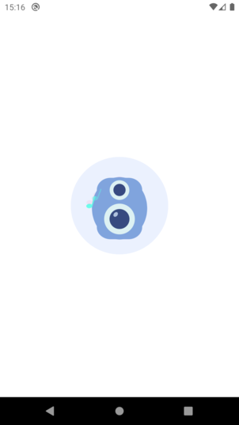
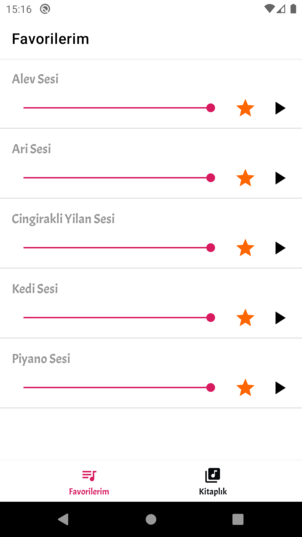
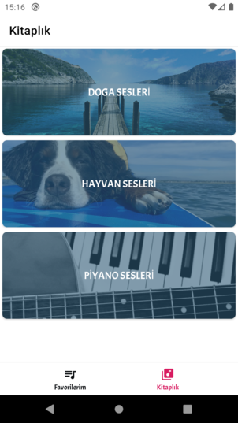

GITHUB TEKNASYON® INTERVIEW
=========================

A Github Teknasyon ® Interview App illustrating current Android Architecture state using Android development best
practices.

Introduction
------------

The application uses Clean Architecture based on MVVM and Repository patterns. Implemented
Architecture principles follow Google recommended [Guide to app architecture](https://developer.android.com/jetpack/docs/guide).

The application is written entirely in Kotlin.

Android Jetpack is used as an Architecture glue including but not limited to ViewModel, LiveData,
Lifecycles, Navigation, Room and Data Binding. See a complete list in "Libraries used" section.

The application does network HTTP requests via Retrofit, OkHttp and GSON. Loaded data  and favorite list is saved to
SQL based database Room, which serves as single source of truth and support offline mode.

Kotlin Coroutines manage background threads with simplified code and reducing needs for callbacks.
Combination of Coroutines and Kotlin build in functions (transformation, collections) are preferred
over RxJava 2.

Navigation component manages in-app navigation.

Koin is used for dependency injection.

Glide is used for image loading and Timber for logging.

Lottie for loading animation

Flashbar for showing message

MVVM for Architecture Design Pattern

Multi-Module project that separated layer

*** Writed Unit Test without local and UI

A sample app consist of 4 screens: Splash, List of Favorites, Library[Category] and Category Details.

Set-Up Backend Services on Local Machine
-----------

First download Free Version.
Here is Link: [https://www.mamp.info/en/downloads/]

Second copy to relaxy folder that is in the project under the backend folder

After that paste to relaxy folder in MAMP -> htdocs -> relaxy

Last Part -> just start server on your local

Thats it :D

[relaxy folder](screenshots/backend.png "copy to relaxy folder")

Multi-Module
-----------

Screenshots
-----------

Libraries Used
--------------

The application goal is to show case current Android Architecture state using out of box
Android tools made by Google (Android Jetpack) and 3rd party community driven libraries.

Android Jetpack is a set of components, tools and guidance to make great Android apps. They bring
together the existing Support Library and Architecture Components and arranges them into four
categories:

* [Foundation][0] - Components for core system capabilities, Kotlin extensions and support for
  multidex and automated testing.
  * [AppCompat][1] - Degrade gracefully on older versions of Android.
  * [Android KTX][2] - Write more concise, idiomatic Kotlin code.
  * [Test][4] - An Android testing framework for unit and runtime UI tests.
* [Architecture][10] - A collection of libraries that help you design robust, testable, and
  maintainable apps. Start with classes for managing your UI component lifecycle and handling data
  persistence.
  * [Data Binding][11] - Declaratively bind observable data to UI elements.
  * [Lifecycles][12] - Create a UI that automatically responds to lifecycle events.
  * [LiveData][13] - Build data objects that notify views when the underlying database changes.
  * [Navigation][14] - Handle everything needed for in-app navigation.
  * [Room][16] - SQLite database with in-app objects and compile-time checks.
  * [ViewModel][17] - Store UI-related data that isn't destroyed on app rotations. Easily schedule
     asynchronous tasks for optimal execution.
* [UI][30] - Details on why and how to use UI Components in your apps - together or separate.
  * [Animations & Transitions][31] - Move widgets and transition between screens.
  * [Fragment][34] - A basic unit of composable UI.
  * [Layout][35] - Lay out widgets using different algorithms.
  * [Material][36] - Material Components.
* Third party
  * [Kotlin Coroutines][91] for managing background threads with simplified code
     and reducing needs for callbacks.
  * [Koin][92] A fast dependency injector.
  * [Retrofit 2][93] A configurable REST client.
  * [OkHttp 3][94] A type-safe HTTP client.
  * [GSON][95] A Json - Object converter using reflection.
  * [Glide][90] Image loading.
  * [Timber][96] A logger.
  * [Lottie][97] Loading animation.
  * [Flashbar][100] for show message

[0]: https://developer.android.com/jetpack/components
[1]: https://developer.android.com/topic/libraries/support-library/packages#v7-appcompat
[2]: https://developer.android.com/kotlin/ktx
[4]: https://developer.android.com/training/testing/
[10]: https://developer.android.com/jetpack/arch/
[11]: https://developer.android.com/topic/libraries/data-binding/
[12]: https://developer.android.com/topic/libraries/architecture/lifecycle
[13]: https://developer.android.com/topic/libraries/architecture/livedata
[14]: https://developer.android.com/topic/libraries/architecture/navigation/
[16]: https://developer.android.com/topic/libraries/architecture/room
[17]: https://developer.android.com/topic/libraries/architecture/viewmodel
[18]: https://developer.android.com/topic/libraries/architecture/workmanager
[19]: https://developer.android.com/topic/libraries/architecture/paging
[30]: https://developer.android.com/guide/topics/ui
[31]: https://developer.android.com/training/animation/
[34]: https://developer.android.com/guide/components/fragments
[35]: https://developer.android.com/guide/topics/ui/declaring-layout
[36]: https://material.io/develop/android/docs/getting-started/
[90]: https://bumptech.github.io/glide/
[91]: https://kotlinlang.org/docs/reference/coroutines-overview.html
[92]: https://insert-koin.io/
[93]: https://square.github.io/retrofit/
[94]: https://square.github.io/okhttp/
[95]: https://github.com/google/gson
[96]: https://github.com/JakeWharton/timber
[97]: https://github.com/airbnb/lottie-android
[100]: https://github.com/aritraroy/Flashbar

License
-------

Copyright 2019 developersancho.

Licensed to the Apache Software Foundation (ASF) under one or more contributor
license agreements.  See the NOTICE file distributed with this work for
additional information regarding copyright ownership.  The ASF licenses this
file to you under the Apache License, Version 2.0 (the "License"); you may not
use this file except in compliance with the License.  You may obtain a copy of
the License at

  http://www.apache.org/licenses/LICENSE-2.0

Unless required by applicable law or agreed to in writing, software
distributed under the License is distributed on an "AS IS" BASIS, WITHOUT
WARRANTIES OR CONDITIONS OF ANY KIND, either express or implied.  See the
License for the specific language governing permissions and limitations under
the License.
